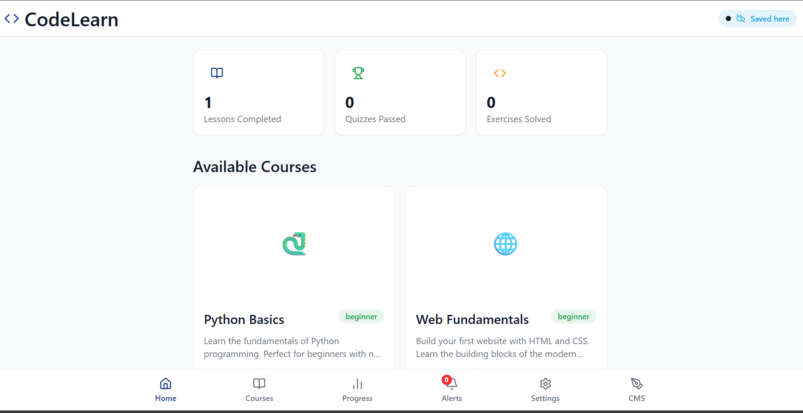
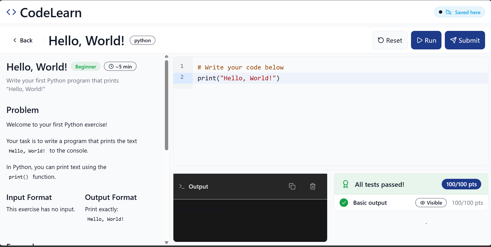
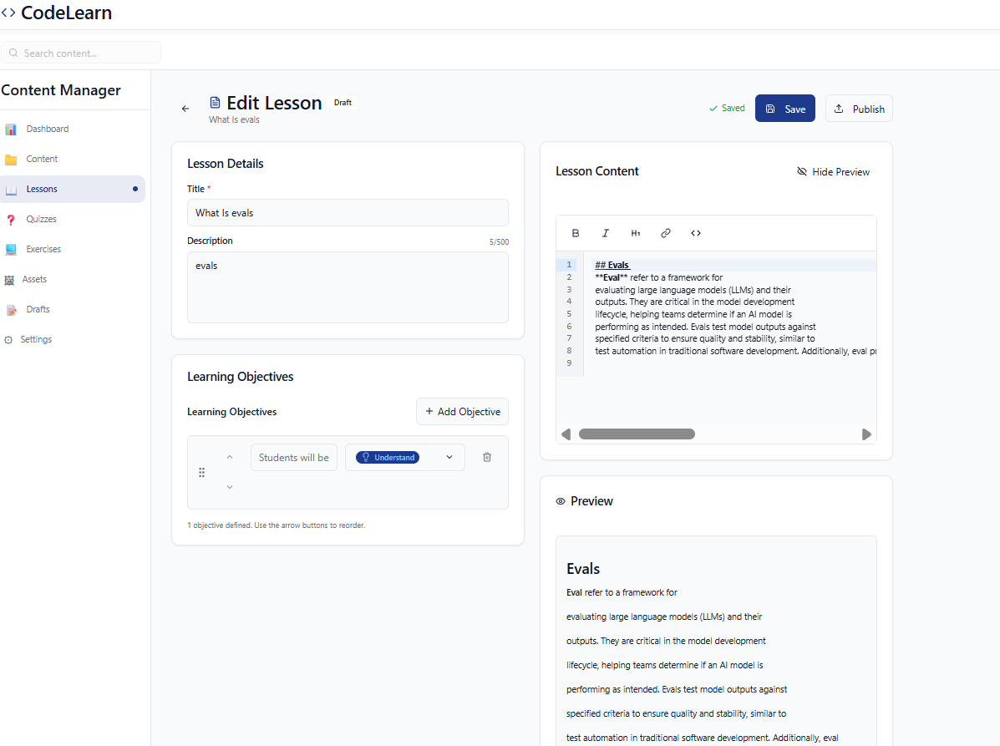

# CodeLearn

An offline-first Progressive Web App (PWA) for coding education, designed for underserved communities with limited or intermittent internet access.

  



| Web IDE | CMS |
|---------|-----|
|  |  |

## Features

### Core Features
- **Offline-First Architecture**: Works without internet for 30+ days
- **Multi-User Support**: Profile switching for shared devices
- **Secure Authentication**: PIN + Pattern Lock MFA
- **Interactive Lessons**: Markdown content with syntax-highlighted code examples
- **Code Workbench**: Python (Pyodide) and JavaScript execution in-browser
- **Quizzes**: Multiple choice and fill-in-the-blank assessments
- **Progress Tracking**: Persistent progress stored locally in IndexedDB
- **Content Management System (CMS)**: Author lessons, quizzes, and exercises with a built-in editor
- **Publishing**: Export content as ZIP or publish directly to Hub

### Technical Highlights
- PWA with Service Worker caching (works offline)
- AES-256-GCM encrypted credentials
- Argon2id password hashing
- Hybrid Logical Clock (HLC) for sync
- CRDT-based conflict resolution

## Tech Stack

| Category | Technology |
|----------|------------|
| Framework | React 19 |
| Build Tool | Vite 7 |
| Styling | Tailwind CSS 4 |
| State | Zustand |
| Database | IndexedDB (Dexie) |
| Code Editor | CodeMirror 6 |
| Python Runtime | Pyodide 0.29 |
| PWA | vite-plugin-pwa |
| UI Components | Radix UI |
| Icons | Lucide React |

## Getting Started

### Prerequisites
- Node.js 18+
- pnpm 8+

### Installation

```bash
# Clone the repository
git clone https://github.com/johnniedom/codelearn.git
cd codelearn

# Install dependencies
pnpm install

# Start development server
pnpm dev
```

The app will be available at `http://localhost:5173`

### Build for Production

```bash
# Build the application
pnpm build

# Preview production build
pnpm preview
```

## Project Structure

```
src/
├── components/          # React components
│   ├── auth/           # PIN, Pattern Lock, Registration
│   ├── cms/            # Content authoring & publishing
│   │   └── editors/    # Markdown, Quiz, Exercise editors
│   ├── common/         # ErrorBoundary, LoadingSkeleton
│   ├── content/        # Lessons, Courses, Progress
│   ├── quiz/           # MCQ, Fill-blank questions
│   ├── workbench/      # Code editor, Output panel
│   ├── sync/           # Sync status indicators
│   └── notifications/  # Notification center
├── pages/              # Route components
├── lib/                # Utilities and services
│   ├── auth/           # Crypto, session management
│   ├── content/        # Package loading, progress tracking
│   ├── execution/      # Python/JS code runners
│   ├── sync/           # HLC, sync service
│   └── db/             # IndexedDB schema (Dexie)
├── stores/             # Zustand state stores
├── types/              # TypeScript definitions
├── data/               # Sample courses and content
└── hooks/              # Custom React hooks
```

## Demo Content

The app includes sample content for testing:

- **Python Basics Course**: 15 lessons covering variables to functions
- **5 Quizzes**: Testing fundamentals, control flow, and loops
- **Code Exercises**: Python and JavaScript challenges

## On-Premise Deployment

CodeLearn is designed for **on-premise classroom deployment** using a local server:

- **Hub Server**: Raspberry Pi 4/5 (~$35) or any school PC running Node.js
- **Local WiFi**: Basic router creates classroom network — no internet required
- **Auto-Install**: Students visit Hub URL → PWA installs automatically with all content
- **Offline Learning**: Students continue at home with 30+ days offline capability
- **Auto-Sync**: Progress syncs via delta-based protocol (HLC timestamps, LWW conflict resolution) when students reconnect to classroom WiFi
- **Content Loading**: Via internet, USB drive, or SD card

See [Architecture Document](docs/ARCHITECTURE.md) for detailed deployment diagrams and specifications.

## Known Limitations

### Current MVP Limitations
1. **Hub Server**: Client-side sync logic complete; hub server deployment uses simulated responses for demo
2. **Background Sync**: Service Worker sync not fully wired
3. **Video Content**: Schema defined, player not implemented
4. **Advanced Quiz Types**: Only MCQ and fill-blank (6 other types planned)

### Browser Support
- Chrome/Edge 90+
- Firefox 90+
- Safari 15+
- Mobile: Android Chrome, iOS Safari

### Performance Notes
- Pyodide initial load: ~10MB download (cached after first use)
- Recommended: 4GB+ RAM for Python execution
- IndexedDB storage: ~100MB per user

## Development

### Available Scripts

```bash
pnpm dev          # Start dev server
pnpm build        # Production build
pnpm preview      # Preview production build
pnpm lint         # Run ESLint
pnpm type-check   # Run TypeScript checks
```

### Environment Variables

Create `.env.local` for local development:

```env
# Optional: Hub server URL
VITE_HUB_URL=http://localhost:3000
```

## Contributing

1. Fork the repository
2. Create a feature branch (`git checkout -b feature/amazing-feature`)
3. Commit your changes (`git commit -m 'Add amazing feature'`)
4. Push to the branch (`git push origin feature/amazing-feature`)
5. Open a Pull Request

## License

This project is licensed under the MIT License.

## Acknowledgments

- [Pyodide](https://pyodide.org/) - Python in the browser
- [CodeMirror](https://codemirror.net/) - Code editor
- [Radix UI](https://radix-ui.com/) - Accessible components
- [Tailwind CSS](https://tailwindcss.com/) - Utility-first CSS
- [Dexie.js](https://dexie.org/) - IndexedDB wrapper
